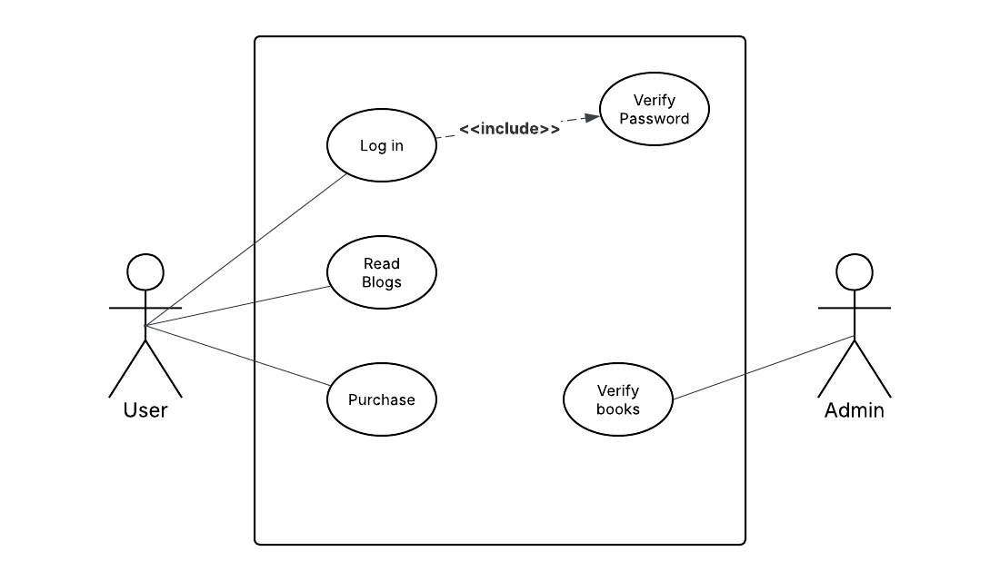
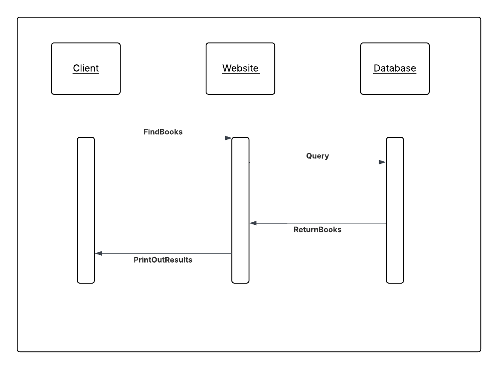
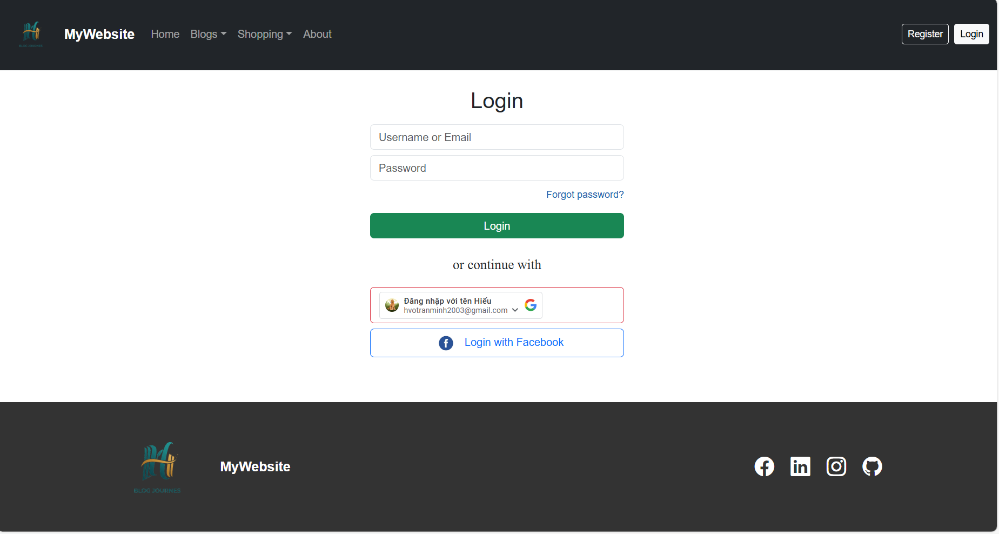
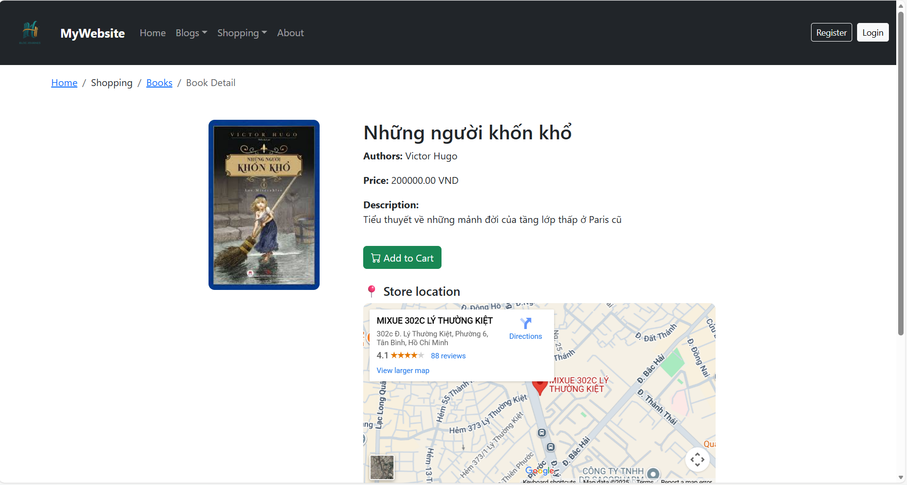
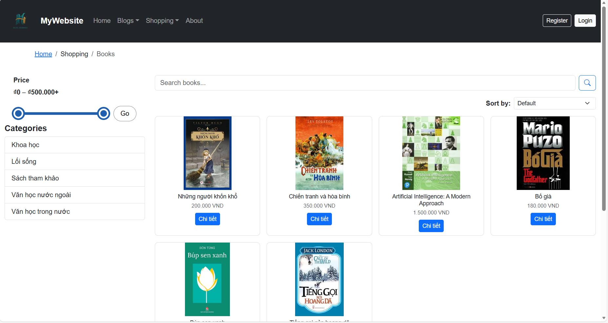
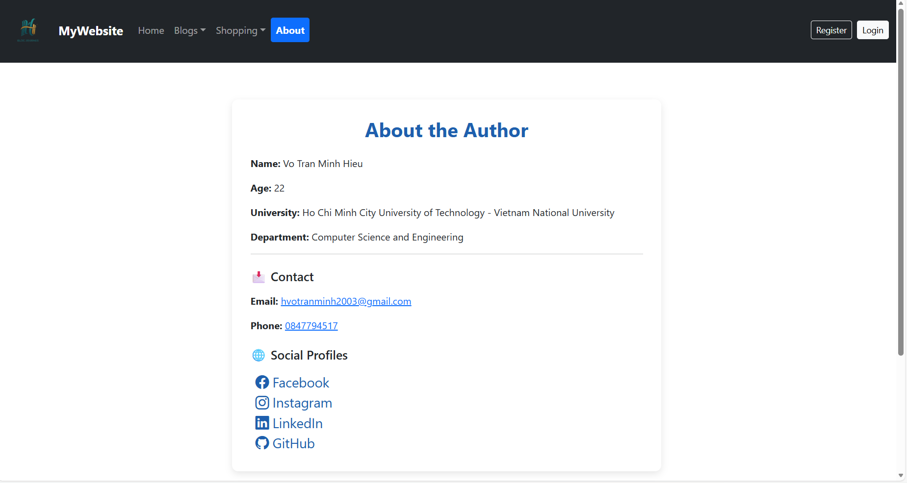

# MyWebsite - Simplified Project README

## Project Overview
MyWebsite is a personal web development project that combines a blog-style website with product browsing features. The goal is to build a complete, user-friendly web application where visitors can explore content, search products, and use secure account features.

This project was developed as part of the Web Development course (CO3049), Semester 251 (2025-2026).

## Main Goals
- Practice end-to-end web development from frontend to backend.
- Build a responsive website that works on desktop and mobile devices.
- Implement core user authentication flows (register, login, logout, password reset).
- Apply database design, API-based backend logic, and SEO fundamentals.

## Key Features
- Built a complete multi-page web application with clear user flows across Home, About, Product Listing, Product Detail, and Authentication pages.
- Implemented a production-style authentication system: registration, email verification, secure login/logout, password recovery, and Google OAuth sign-in via Google APIs.
- Developed a high-utility product discovery experience with category filters, price-range filtering, pagination, and real-time AJAX search suggestions while mitigating SQL injection risks through prepared queries.
- Integrated Google Maps APIs to help users locate store-related locations directly from the website.
- Added session-aware navigation to dynamically render guest vs. authenticated user actions for a more personalized UX.
- Delivered a responsive, mobile-first interface focused on readability, accessibility, and consistent interaction patterns across devices.

## Design Summary
- Visual direction inspired by large e-commerce (Amazon, etc.) layouts for familiarity.
- Strong contrast and clean backgrounds to improve clarity.
- Consistent styling across navigation, cards, forms, and action buttons.
- Focus on readable typography, spacing, and clear content structure.

## Architecture
Use Case Diagram:

Sequence Diagram:

- Frontend: Structured pages with interactive behavior and dynamic component loading.
- Backend: Modular API endpoints handling authentication, catalog data, session checks, categories, and search.
- Database: Relational model for users, products, and categories.
- Third-party integrations: Email services and social login support.

## Security and Reliability Highlights
- Password hashing for credential protection.
- Prepared database queries to reduce injection risks.
- Token-based email verification and password reset flows.
- Session validation for persistent and secure user state.
- Structured error handling for API responses.

## SEO and Accessibility
- Page-level metadata and semantic content structure.
- Social sharing metadata for major platforms.
- Technical SEO support through sitemap and crawler directives.
- Mobile-first responsiveness and keyboard-friendly interaction patterns.

## Demonstration
### Login Page

### Product Detail Page

### Product Page

### About Page

## Future Improvements
- Complete unfinished content pages and polish all user-facing text.
- Add shopping cart and payment features.
- Introduce user profile enhancements (account info, favorites, personalization).
- Expand content creation and review capabilities.
- Further refine data relationships and business rules defined in the system design.
 
